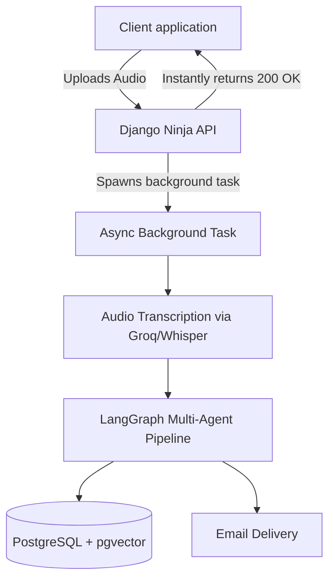
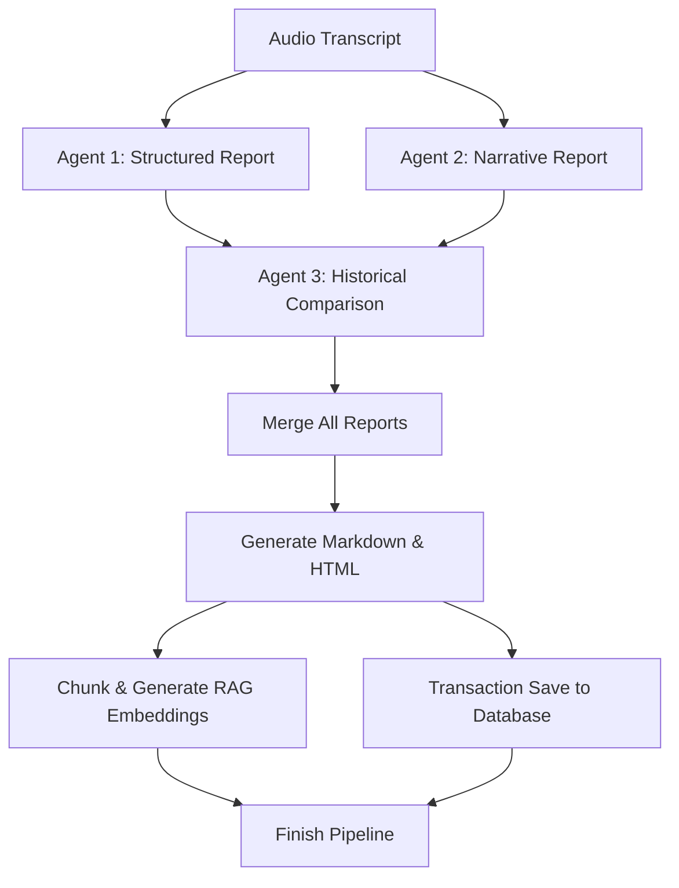
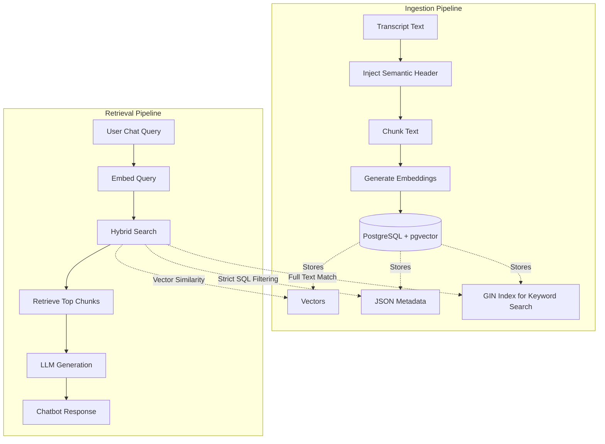

# Meeting Intelligence Platform

I started this project to solve a specific problem: organizations spend countless hours on calls, but extracting actionable insights, tracking historical context, and generating reports takes too much manual effort. This platform automates that entire workflow using a multi-agent AI system.

## High-Level Architecture

At its core, this is an asynchronous Python backend built with Django Ninja and served via Uvicorn. To keep the API highly responsive, the heavy AI processing is completely detached from the HTTP request cycle and handled in background tasks.

## AI Agent Workflow (LangGraph)

The intelligence of the platform is driven by LangGraph. Instead of relying on a single large prompt, the system routes the transcript through specialized agents running in parallel. I designed it to gracefully fall back to alternative models (e.g., from OpenRouter to Gemini) if API rate limits or failures occur.

## RAG & Retrieval Architecture

I built a custom Retrieval-Augmented Generation (RAG) pipeline to power the chat interface. Instead of just doing a basic vector similarity search, I implemented a hybrid approach. Every chunk of transcript is injected with a "Semantic Header" (containing metadata like the organization, salesperson, and meeting details) before embedding to give the LLM better raw context. 

During retrieval, the system combines semantic vector search (via pgvector) with hard SQL metadata filtering and Full-Text Search (GIN indexing). This ensures that chatbot responses are highly relevant and strictly isolated to the correct organization and customer.

## Tech Stack

* **Backend:** Django, Django Ninja Extra, Uvicorn (ASGI)
* **AI Orchestration:** LangChain, LangGraph
* **Models:** OpenRouter (Llama), Gemini (Fallback), Groq (Whisper for STT)
* **Database:** PostgreSQL with pgvector (for RAG and semantic search)
* **Concurrency:** Python asyncio, custom async database handlers (sync_to_async)

## Current Status

This project is in active development. The core multi-agent pipeline is functional: it successfully processes audio asynchronously, generates comprehensive meeting analyses, stores vector embeddings for semantic search, and triggers email reports. Future updates will focus on refining the RAG retrieval pipeline for the chatbot interface and expanding the deployment infrastructure.
