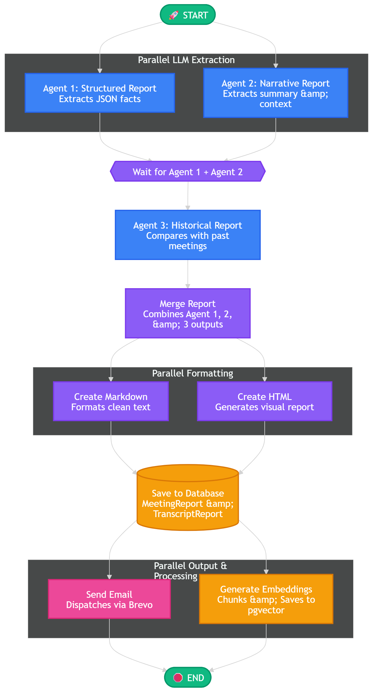

# Meeting Intelligence Platform

I started this project to solve a specific problem: organizations spend countless hours on calls, but extracting actionable insights, tracking historical context, and generating reports takes too much manual effort. This platform automates that entire workflow using a multi-agent AI system.

## High-Level Architecture

At its core, this is an asynchronous Python backend built with Django Ninja and served via Uvicorn. To keep the API highly responsive, the heavy AI processing is completely detached from the HTTP request cycle and handled in background tasks.

### Meeting Processing Agent

  

### RAG & Retrieval Architecture

  

## Tech Stack

* **Backend:** Django, Django Ninja Extra, Uvicorn (ASGI)
* **AI Orchestration:** LangChain, LangGraph
* **Models:** OpenRouter (Llama), Gemini (Fallback), Groq (Whisper for STT)
* **Database:** PostgreSQL with pgvector (for RAG and semantic search)
* **Concurrency:** Python asyncio, custom async database handlers (sync_to_async)

## Current Status

This project is in active development. The core multi-agent pipeline is functional: it successfully processes audio asynchronously, generates comprehensive meeting analyses, stores vector embeddings for semantic search, and triggers email reports. Future updates will focus on refining the RAG retrieval pipeline for the chatbot interface and expanding the deployment infrastructure.

In Future I will be working on fully automatic pipeline right now you have to manually paste the transcript or audio recording of meeting to get started but eventually it will be automatic.

